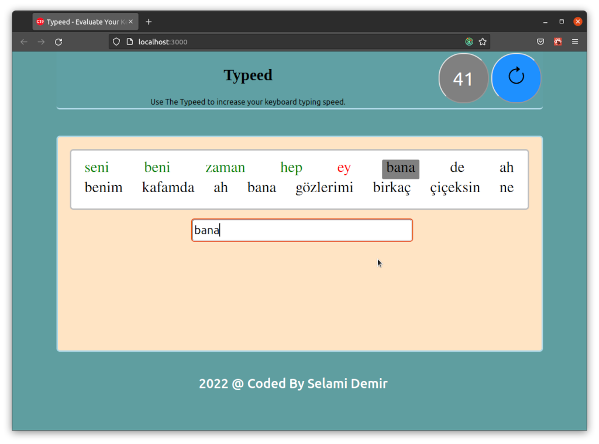

# Typeed
## The app evaluate user write speed on keyboard.

Patika Redux dersinde verilmiş olan, klavye hız yazım testi uygulaması. 
## Kullanımı
Hız testi başladığında ekandaki yazıları
okuyarak, olabildiğince doğru ve hızlı yazmanız gerekiyor. En az hata ile en çok yazıyı yazın.

## Geliştirme Araçları

Uygulama, React, Redux ile geliştirilmiştir. UI tasarımında HTML ve CSS kullanılmıştır. Ayrıca farklı bir
UI kütüphanesi kullanılmadı.

## Yapılacaklar

Uygulama şuan başarılı bir şekilde çalışsa da kodda sadeleştirme ve tasarım bazında bazı dokunmalar gerektiriyor.
Sunucu ile bağlantılı çalışmadığı için en hızlılar listesi eklenmeyecek. Fakat aynı tarayıcıdan giriş yapanlar
için sonucun **localStorage** üzerinde tutulması eklenebilir.

## Ekran Görüntüsü

Şuan için uygulamadaki ekran görüntüsü aşağıdaki gibidir.

